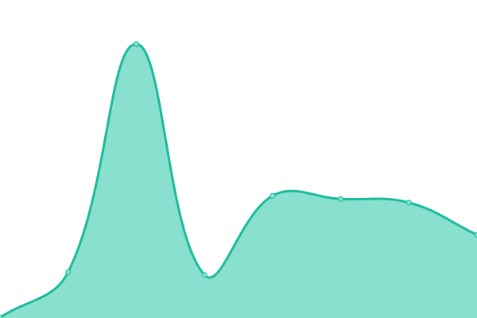

# [📈 Live Status](https://uptime.backupmode.xyz): <!--live status--> **🟧 Partial outage**

This repository contains the open-source uptime monitor and status page for [Backup-Mode](https://backupmode.xyz/), powered by [Upptime](https://github.com/upptime/upptime).

With [Upptime](https://upptime.js.org), you can get your own unlimited and free uptime monitor and status page, powered entirely by a GitHub repository. We use [Issues](https://github.com/Backup-Mode/upptime/issues) as incident reports, [Actions](https://github.com/Backup-Mode/upptime/actions) as uptime monitors, and [Pages](https://uptime.backupmode.xyz) for the status page.

<!--start: status pages-->
<!-- This summary is generated by Upptime (https://github.com/upptime/upptime) -->
<!-- Do not edit this manually, your changes will be overwritten -->
<!-- prettier-ignore -->
| URL | 狀態 | 歷史 | Response Time | Uptime |
| --- | ------ | ------- | ------------- | ------ |
|  [Website](https://backupmode.xyz/) | 在線 | [website.yml](https://github.com/Backup-Mode/uptime/commits/HEAD/history/website.yml) | 

 1011ms
     
 | 

<a href="https://uptime.backupmode.xyz/history/website">100.00%</a>
    

|  [Dashboard](https://dash.backupmode.xyz/) | 離線 | [dashboard.yml](https://github.com/Backup-Mode/uptime/commits/HEAD/history/dashboard.yml) | 

 0ms
     
 | 

<a href="https://uptime.backupmode.xyz/history/dashboard">0.00%</a>
    

|  [Store](https://store.backupmode.xyz/) | 在線 | [store.yml](https://github.com/Backup-Mode/uptime/commits/HEAD/history/store.yml) | 

 12292ms
     
 | 

<a href="https://uptime.backupmode.xyz/history/store">96.92%</a>
    

|  [Docs](https://docs.backupmode.xyz/) | 在線 | [docs.yml](https://github.com/Backup-Mode/uptime/commits/HEAD/history/docs.yml) | 

 251ms
     
 | 

<a href="https://uptime.backupmode.xyz/history/docs">100.00%</a>
    

|  Main Bot | 離線 | [main-bot.yml](https://github.com/Backup-Mode/uptime/commits/HEAD/history/main-bot.yml) | 

 0ms
     
 | 

<a href="https://uptime.backupmode.xyz/history/main-bot">0.00%</a>
    

|  System Bot | 離線 | [system-bot.yml](https://github.com/Backup-Mode/uptime/commits/HEAD/history/system-bot.yml) | 

 0ms
     
 | 

<a href="https://uptime.backupmode.xyz/history/system-bot">0.00%</a>
    

|  Dashboard System | 離線 | [dashboard-system.yml](https://github.com/Backup-Mode/uptime/commits/HEAD/history/dashboard-system.yml) | 

 0ms
     
 | 

<a href="https://uptime.backupmode.xyz/history/dashboard-system">0.00%</a>
    

<!--end: status pages-->

[**Visit our status website →**](https://uptime.backupmode.xyz)

## 📄 License

- Powered by: [Upptime](https://github.com/upptime/upptime)
- Code: [MIT](./LICENSE) © [Backup-Mode](https://backupmode.xyz/)
- Data in the `./history` directory: [Open Database License](https://opendatacommons.org/licenses/odbl/1-0/)
